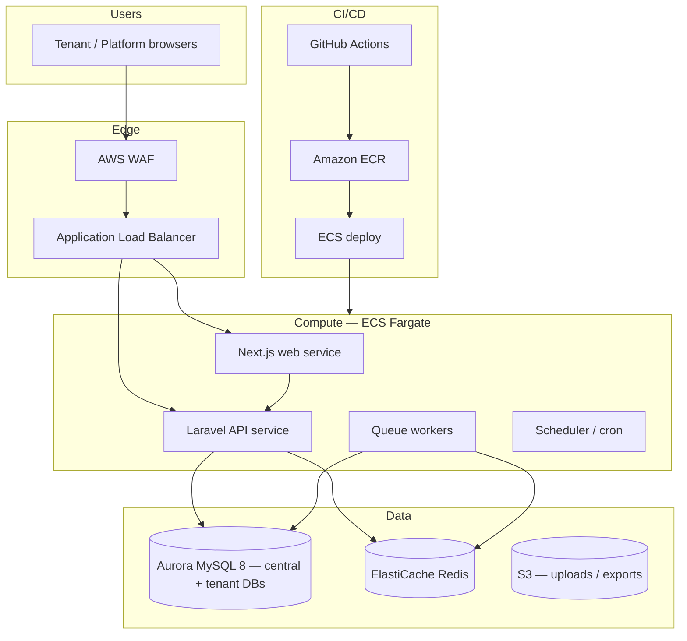

# TowerOS Phase 1 — AWS ECS, Aurora, CI/CD

Board Phase 1 target infrastructure for TowerOS production. This document defines the **foundation** architecture and deployment pipeline; resources are not provisioned in the local dev stack.

## Architecture overview

## Environment tiers

| Tier | Purpose | Notes |
|------|---------|-------|
| **dev** | Engineer sandboxes | Smallest Fargate tasks; single-AZ Aurora dev cluster |
| **staging** | Pre-production validation | Mirrors prod topology at reduced scale |
| **production** | Customer workloads | Multi-AZ Aurora, autoscaling, WAF, Secrets Manager |

## ECS services (Fargate)

| Service | Image | Port | Health check |
|---------|-------|------|--------------|
| `toweros-api` | Laravel (PHP-FPM + nginx sidecar or Octane) | 8000 | `GET /up` |
| `toweros-web` | Next.js standalone | 3000 | `GET /` |
| `toweros-worker` | Same API image, `queue:work` | — | process heartbeat |
| `toweros-scheduler` | Same API image, `schedule:run` loop | — | CloudWatch logs |

**Task sizing (starting point):**

- API: 0.5 vCPU / 1 GB (scale on CPU + request count)
- Web: 0.5 vCPU / 1 GB
- Worker: 0.25 vCPU / 512 MB per queue priority lane

## Aurora MySQL

- **Engine:** Aurora MySQL 8.0 compatible (matches local MySQL 8 dev)
- **Topology:** writer + 1–2 readers (production)
- **Tenancy:** database-per-tenant (stancl/tenancy); central schema on `toweros` database
- **Backups:** automated snapshots (7–35 days by tier), point-in-time recovery enabled
- **Secrets:** credentials in AWS Secrets Manager; injected into ECS task definitions

## Supporting AWS services

- **ElastiCache Redis** — cache, sessions (if not DB), queues (or SQS for cross-AZ durability)
- **S3** — document uploads, CSV exports, static report artifacts
- **ACM + Route 53** — TLS certificates and tenant wildcard DNS (`*.toweros.app`)
- **CloudWatch** — logs, metrics, alarms (5xx rate, queue depth, Aurora CPU)
- **Secrets Manager** — DB, Redis, OAuth, Sanctum keys

## CI/CD pipeline (GitHub Actions)

Repository workflow: [`.github/workflows/ci.yml`](../../.github/workflows/ci.yml)

### Pull request (CI)

1. Backend: `composer install`, PHP lint, PHPUnit
2. Frontend: `npm ci`, ESLint, TypeScript check, production build
3. Optional: Docker image build (no push) to catch Dockerfile regressions

### Main branch (CD — staging)

1. Build and push images to ECR (`toweros-api`, `toweros-web`)
2. Run central + tenant migration task on ECS one-off task
3. Rolling deploy to staging ECS services
4. Smoke tests against staging ALB

### Release tag `v*` (CD — production)

1. Promote tested ECR image digests (no rebuild)
2. Blue/green or rolling deploy with circuit breaker
3. Post-deploy: `/up`, tenant login smoke, queue drain check

## Required GitHub / AWS secrets

| Secret | Used for |
|--------|----------|
| `AWS_ROLE_ARN` | OIDC deploy role (no long-lived keys) |
| `AWS_REGION` | e.g. `ap-southeast-1` |
| `ECR_REGISTRY` | `123456789012.dkr.ecr.region.amazonaws.com` |

Application secrets remain in AWS Secrets Manager per environment.

## Local vs cloud parity

| Concern | Local (`dev.cmd`) | AWS |
|---------|-------------------|-----|
| Database | Docker MySQL 3307 | Aurora MySQL |
| Cache/queue | Optional Redis | ElastiCache / SQS |
| Web port | 80 (`http://localhost`) | 443 via ALB |
| Tenancy | `*.localhost` | `*.toweros.app` |

## Phase 1 deliverables checklist

- [x] CI workflow skeleton (lint, test, build)
- [ ] Terraform / CDK modules for VPC, ECS, Aurora, Redis
- [ ] ECR repositories + lifecycle policies
- [ ] Staging environment first deploy
- [ ] Runbook: migrate, rollback, tenant provision

## Operations runbook (summary)

**Deploy:** merge to `main` → CI green → staging deploy → manual promote to prod tag.

**Migrate:** ECS run-task `php artisan migrate --force` (central), then `tenants:migrate --force`.

**Rollback:** ECS circuit breaker auto-revert; DB rollback via snapshot restore (break-glass only).

**Scale:** target tracking on API CPU (70%) and ALB request count per target.
