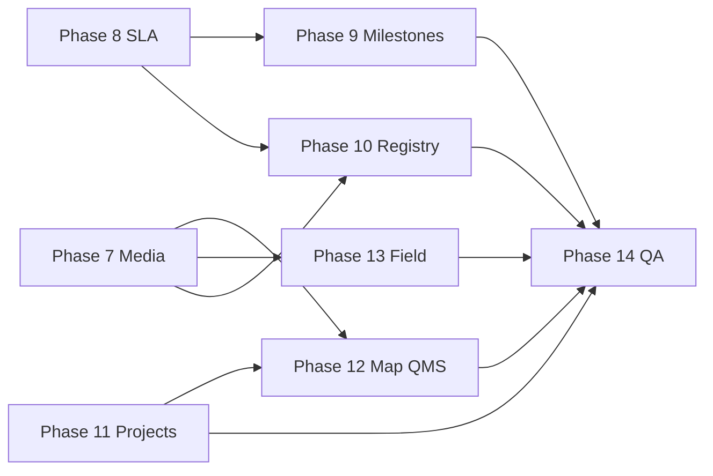

# PROJECT-ONE — Roadmap (Phases 7–14)

Phases **1–6** delivered the rollout pilot loop (create → timeline → SAQ → CME → profitability → gates → RFI → tenant bootstrap).

This document plans **Phases 7–14** for everything still pending in PROJECT-ONE.

---

## Phase overview

| Phase | Title | Focus | Depends on |
|-------|--------|--------|------------|
| [7](./rollout-playbook-phase7.md) | Media & lease package | File uploads, `photo_links`, `lease_package` UI | — ✅ |
| [8](./rollout-playbook-phase8.md) | SLA precision & ops | Region-aware holidays, SLA recalc command, gate backfill | — ✅ |
| [9](./rollout-playbook-phase9.md) | Milestone cycle tracker | 19 playbook `milestone_cycle_targets` in UI | 8 (dates) ✅ |
| [10](./rollout-playbook-phase10.md) | Rollout registry & audit | List filters/export, cancel/edit, audit trail | 7 (attachments optional) ✅ |
| [11](./rollout-playbook-phase11.md) | Projects integration | Project CRUD, detail, rollout ↔ project link | — ✅ |
| [12](./rollout-playbook-phase12.md) | Map & QMS depth | Candidate/site map, approvals attachments, dashboard KPIs | 7, 11 ✅ |
| [13](./rollout-playbook-phase13.md) | Field mobile UX | Touch-first SAQ/CME, camera, GPS, offline drafts | 7 ✅ |
| [14](./rollout-playbook-phase14.md) | Platform polish & QA | Playbook upgrade UX, README, full E2E test suite | 7–13 ✅ |

---

## Recommended execution order

**Suggested sprints**

1. **7 + 8** — unblock field evidence and correct SLA math  
2. **9 + 10** — operational visibility for PMO/NOC  
3. **11** — structural link between programs and rollouts  
4. **12 + 13** — map-first and field engineer workflows  
5. **14** — harden for production sign-off  

---

## Out of scope (separate modules / later)

- Full QMS ISO document control
- Vendor portal (VENDOR-ONE)
- Dedicated GIS module depth (FIBER-ONE / GIS map layers)
- PostgreSQL / PostGIS migration (board target; current stack is MySQL)

---

## Completion criteria (module)

PROJECT-ONE reaches **production-ready rollout + QMS baseline** when Phases **7–14** are done and:

- [x] Full rollout lifecycle is auditable (create → RFI or cancel)
- [x] SLA math respects PH holidays **and** rollout region
- [x] SAQ/CME evidence is uploadable (not URL-only)
- [x] Projects and rollouts are navigable as one program story
- [x] Field SAQ workflow works on mobile viewport with camera/GPS
- [x] `php artisan test --filter=Rollout` and project-one feature suite pass in CI

---

## Prior phases

| Phase | Doc |
|-------|-----|
| 1 | [rollout-playbook-phase1.md](./rollout-playbook-phase1.md) |
| 2 | [rollout-playbook-phase2.md](./rollout-playbook-phase2.md) |
| 3 | [rollout-playbook-phase3.md](./rollout-playbook-phase3.md) |
| 4 | [rollout-playbook-phase4.md](./rollout-playbook-phase4.md) |
| 5 | [rollout-playbook-phase5.md](./rollout-playbook-phase5.md) |
| 6 | [rollout-playbook-phase6.md](./rollout-playbook-phase6.md) |
